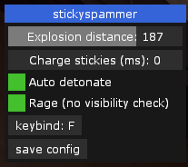

# Stickyspammer

Stickyspammer is a small plugin to help mitigate RSI injuries while playing demoman.
Hold down the key and stickies will fly, optionally set it to auto detonate them as well.

# Requirements
* LMAOBOX beta with LUA support.
* Menulib >= 1.5

# Installation
1. Navigate to `%localappdata%` folder
2. Get Menulib  and save it to the `%localappdata%` folder.
3. copy the `stickyspammer.lua` into `%localappdata%`
4. ??
5. profit.

# notes
- Supports the default aimbot "ignore cloaked", "aim sentry", "aim other buildings" flags. Enable those in the normal aimbot menu and the autodetonation will detonate the stickies near those as well.

#### known problems:
- Menulib doesn't update the keybind name on the UI when it's loaded from configs. Don't mind that, the keybind you save still works.
- Menulib doesn't support mouse keybinds, please type them manually on the `stickyspam.lua`
